# Showcase
Quick tour around my site's past and present, made of random screenshots I accidentally saved (Thank God). See notes at the end.

## Earlier Home
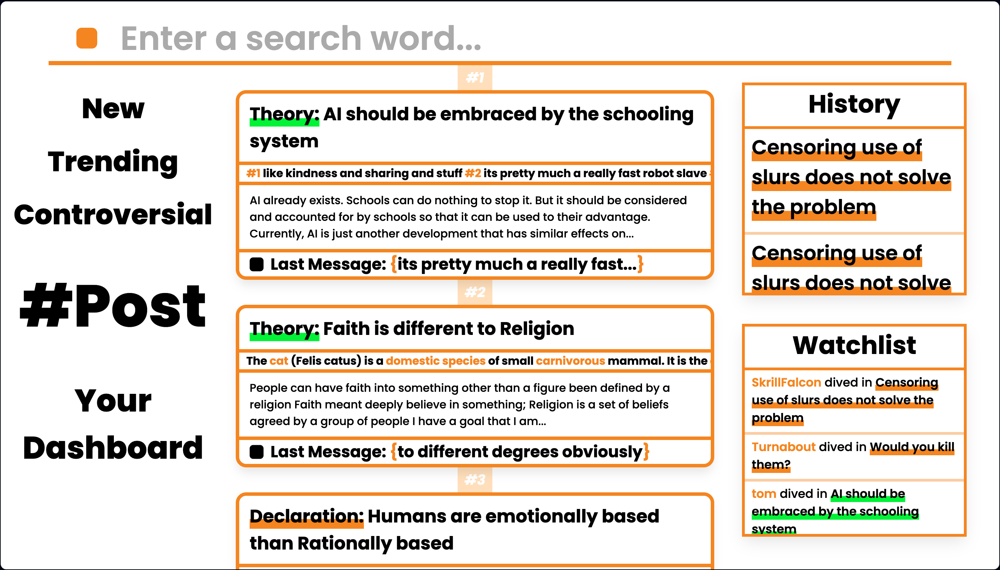
- This is one of the earlier versions of the home page.

## Final Home
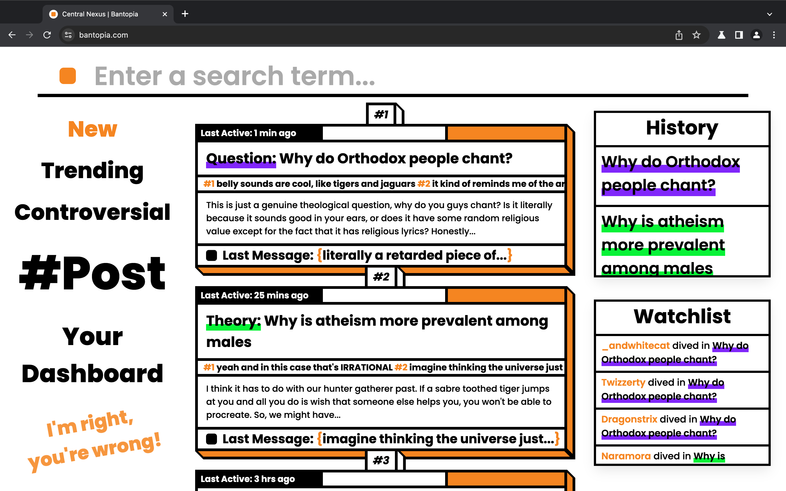
- The last message and last active boxes updated in real time.
- The orange rectancle in the top right corner of each box reacted when a message was sent.
- The randomised little splash text ("I'm right, you're wrong!") in the bottom was inspired from minecraft, it had a similar bobbing animation.

## Search Function
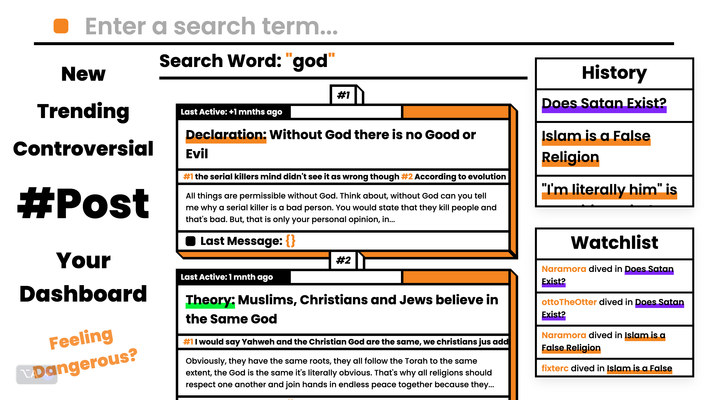
- Fully functional search that ranked the comms (see below for comm definition).

## Comm
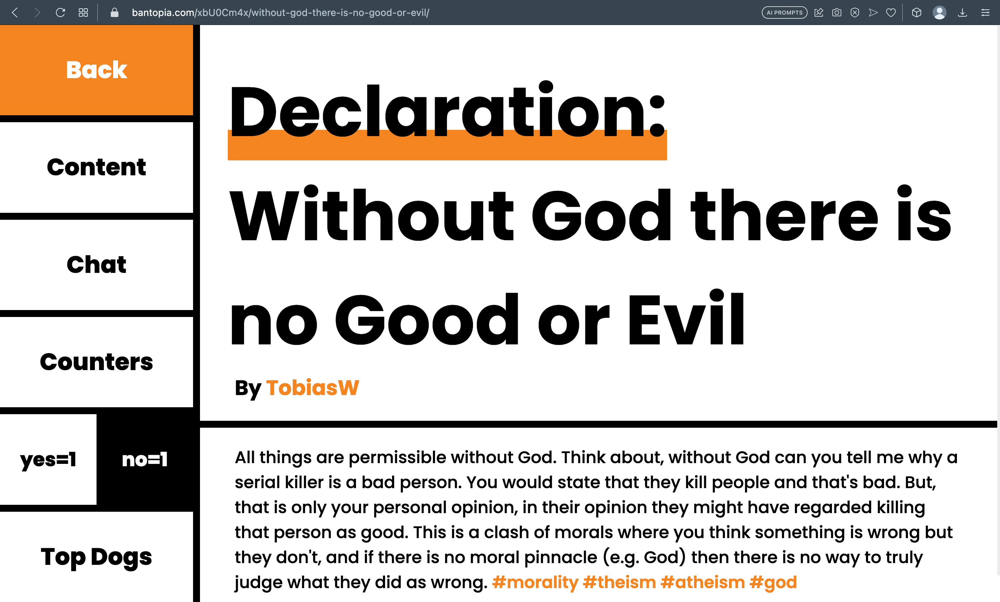
- A comm is a mini chatroom where people can talk about an opinion.
- This is the "content" page of the comm.
- The chat is where you talk.
- Counters displays the most liked message.
- the yes/no in a public vote.
- Top Dogs displays the most liked and most controversial contributer.

## Chat Page of Comm
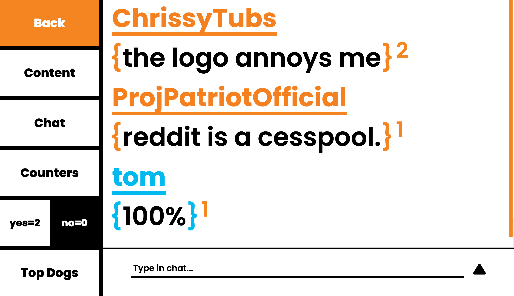
- The brackets either side of the message turn either green or red when the message is hovered over. They can be used to like or dislike the message, and the total likes are denoted by the superscript number.
- You could @mention other users.

## Early Dashboard
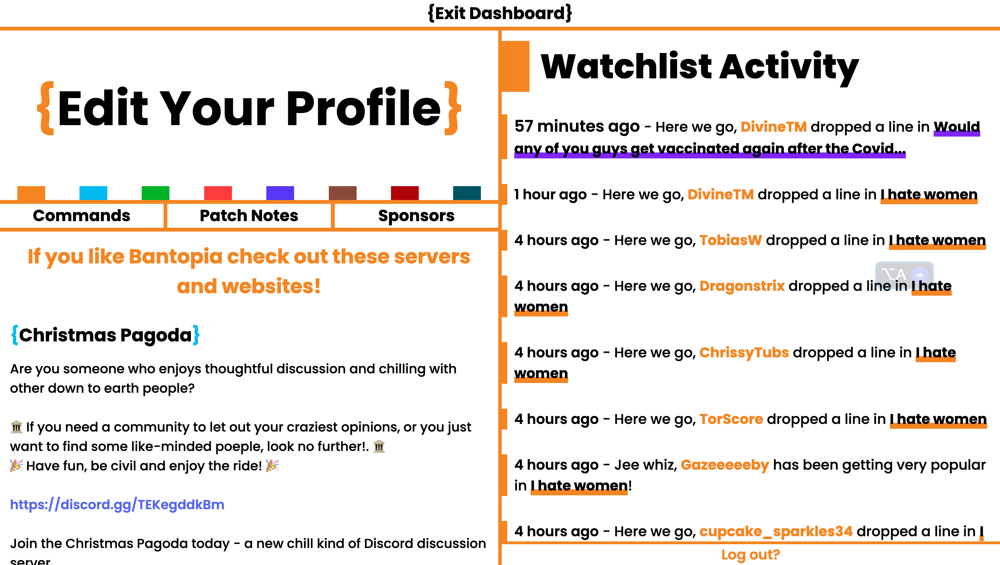
- This is an earlier version of our dashboard.
- You could change your name's color by pressing the colored tabs, I was sporting the blue name color.
- Rules was replaced by Patch Notes.
- Tips was replaced by sponsors (Discord serves that partnered with my website).
- After this version I built an area where users could change their display name or password.

## Early Dashboard

- This is an earlier version of our dashboard.
- You could change your name's color by pressing the colored tabs, I was sporting the blue name color.
- Rules was replaced by Patch Notes.
- Tips was replaced by sponsors (Discord serves that partnered with my website).
- After this version I built an area where users could change their display name or password.

## Posting

- You could post a theory (green), question (purple) or declaration (orange). 
- Tags could be searched for.

## Posting

- You could post a theory (green), question (purple) or declaration (orange). 
- Tags could be searched for.

 
## Mobile Version
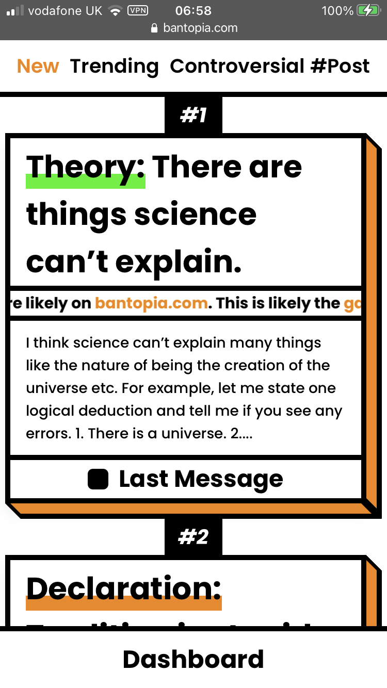
- We had a fully functioning mobile version.
- I don't have many pictures, this is the home page.

## Void update
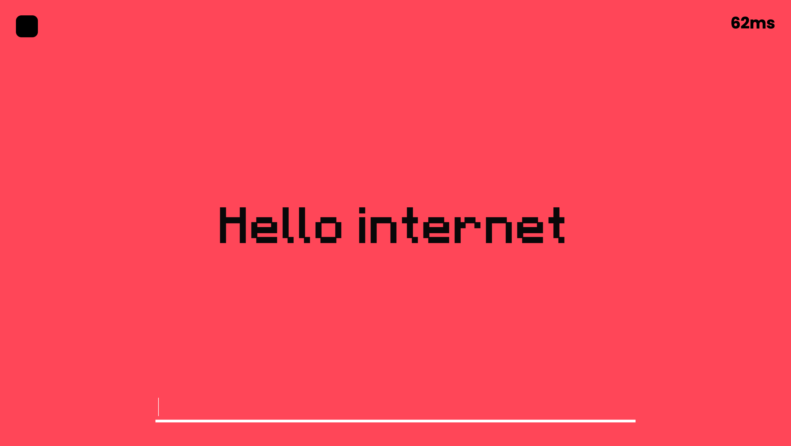
- I bulldozed the site into one huge comm.
- I'm going to continue developing this version of the site.
- It's awfully fun to use.

## Void chats
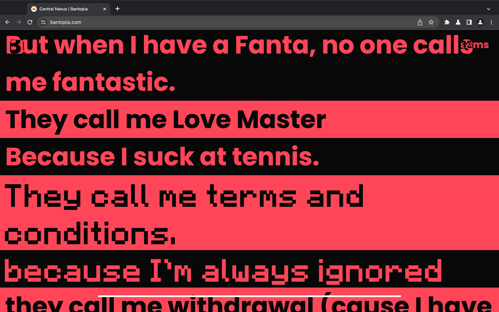
- It's like a Ham Radio with text instead of sounds.
- No display names, or hint who's talking (except maybe different fonts).
- Mods had the minecraft font.
- Feels like you're talking to the void.

## More void jokes
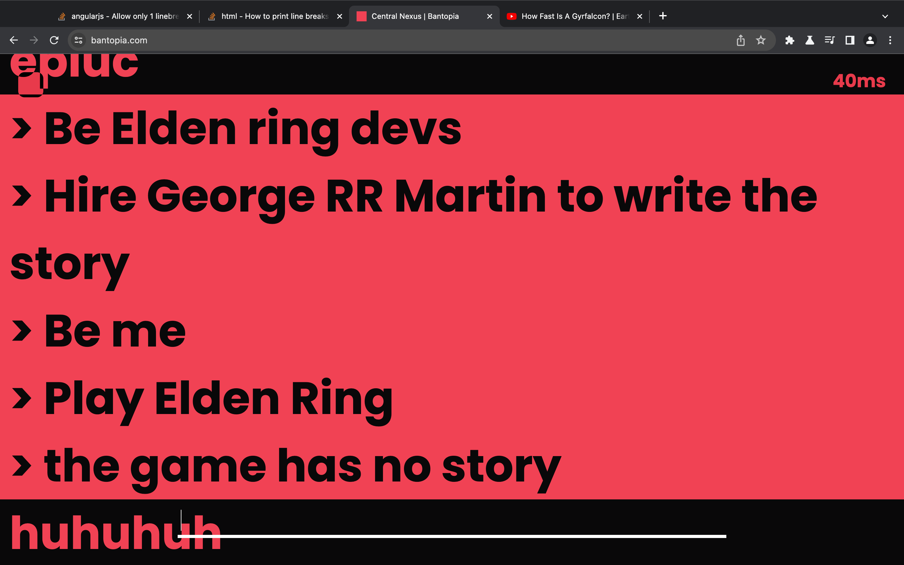
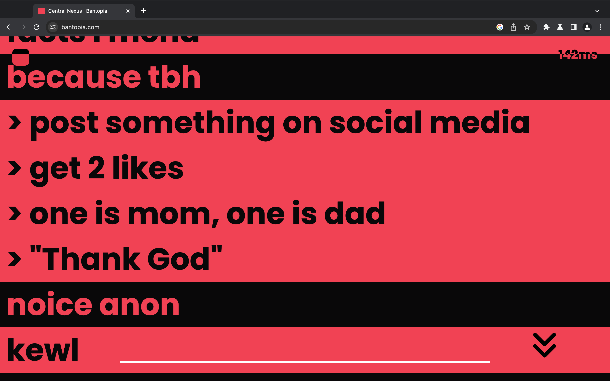

## Final Notes

I have not abandonded bantopia, WE WILL REVOLUTIONALISE HUMAN-TO-HUMAN COMMUNICATION.

Bantopia App Concept (really fun to make): https://github.com/skrillfalconblast/bantopia_app/

**At out height we had:**
- 2.5 debating users at any one time.
- Most of us were regulars.
- 200 accounts registered (before the push towards anonimity for the void update)
